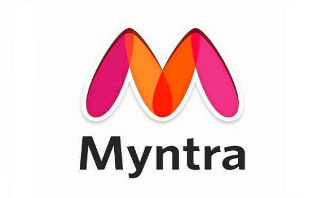
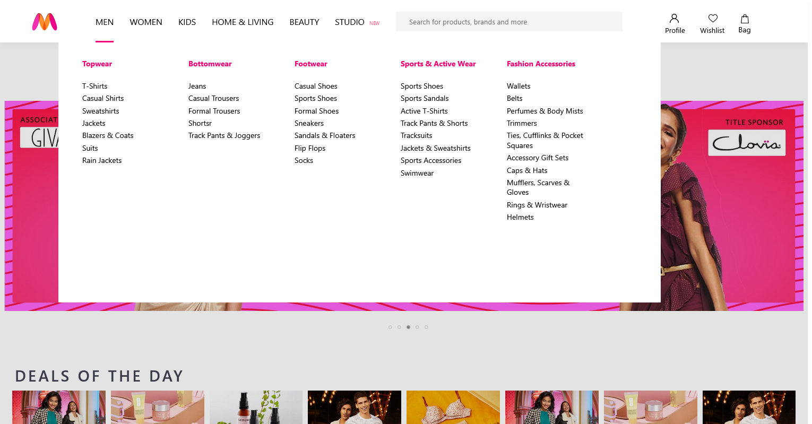
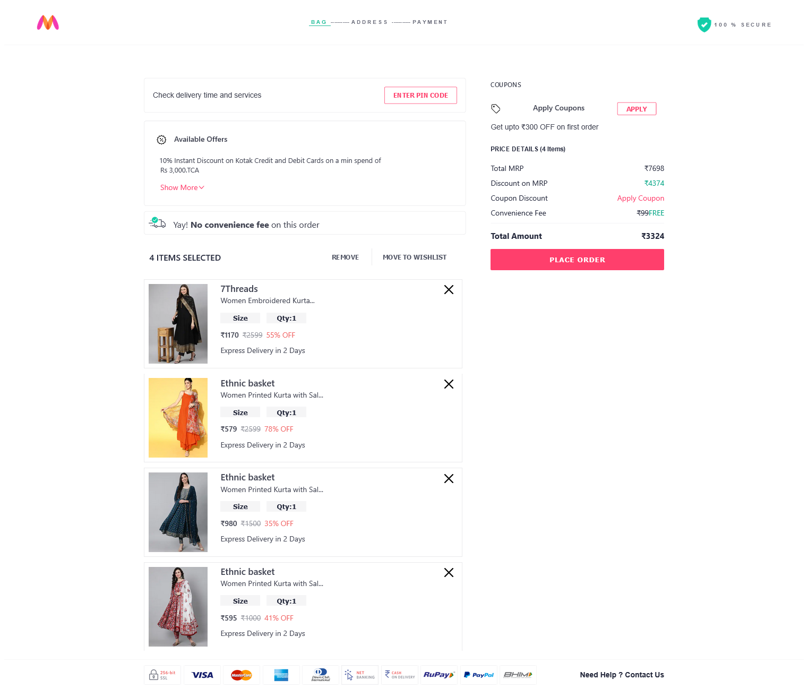
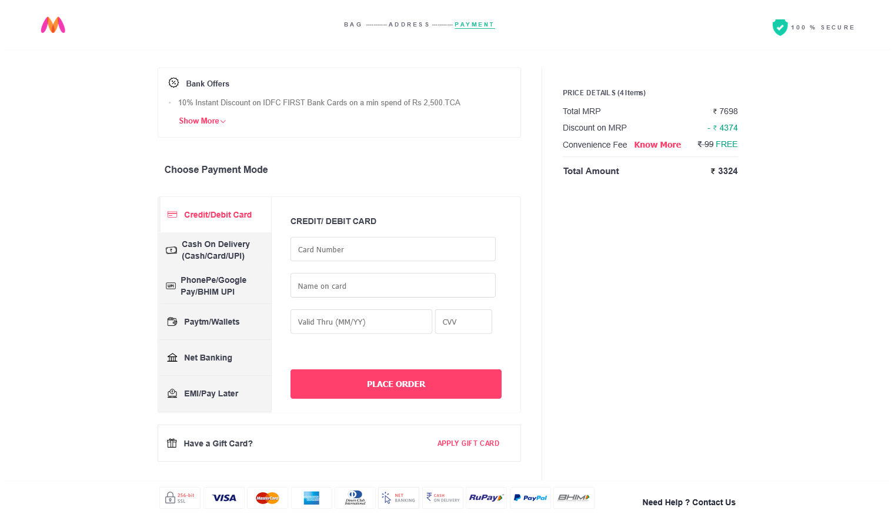
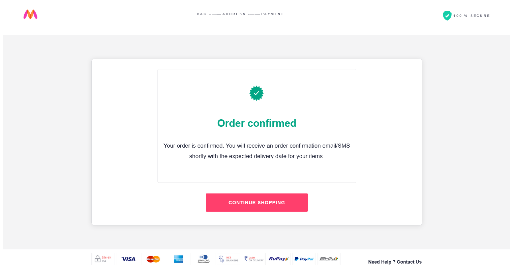

# 🛍️ Myntra Clone

<h1>Myntra Clone - Solo Project</h1>

 

## 📌 Description

<b>This is a solo project built by me.</b>  
I replicated the look and feel of the Myntra website using **HTML, CSS, and JavaScript** in 7 days to practice frontend development skills.

---

## 🔗 Preview

- **Live Website:** [Click Here](myntra-clone-nine-jet.vercel.app)  
- **GitHub Repo:** [Click Here](https://github.com/Abhirkt1996/Myntra-clone)

---

## 🧰 Tech Stack

- **HTML5**
- **CSS3**
- **JavaScript (Vanilla)**
- **LocalStorage**

---

## 🖼️ Pages & Features

### 🏠 Home Page

---

### 🔍 Navigation Bar

---

### 🔐 Signup Page

---

### 🔑 Login Page

---

### 🧔 Men's Product Page

---

### 👩 Women's Product Page

---

### 🛒 Cart Page

---

### 📍 Address Page

---

### 💳 Payment Page

---

### ✅ Order Success Page

---

## 🙋‍♂️ Author

**Abhishek Kumar**  
Full Stack Web Developer | AlmaBetter Graduate  
🔗 [LinkedIn](https://www.linkedin.com/in/abhirkt1996)

---

